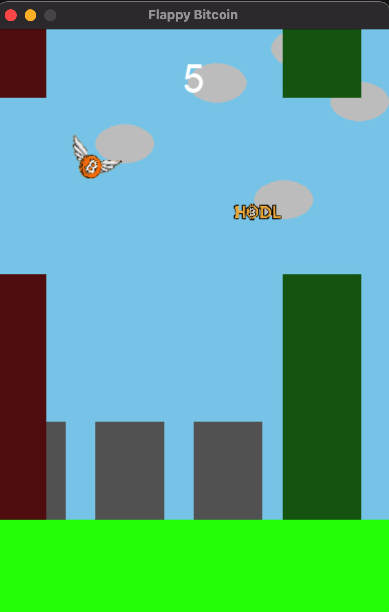

# Flappy Bitcoin  

Fly high with the iconic Bitcoin logo in this addictive Flappy Bird-inspired game! Navigate through a challenging series of pipes and aim for the highest score.

## Features 🚀

* **Classic Flappy Bird Gameplay:**  Tap the space bar to flap the Bitcoin logo and skillfully avoid the green pipes. 
* **Increasing Difficulty:**  The game gets progressively harder as you score higher, testing your reflexes and precision.
* **Dynamic Background:**  Enjoy a visually appealing background with fluffy clouds, towering buildings, and a continuously scrolling green floor.
* **Immersive Sounds and Music:**  Get engaged with background music and sound effects for flapping, collisions, and the end of the game.
* **Charming Flyby Bird:**  A little bird occasionally flies across the screen, adding a touch of whimsy to the gameplay.

## How to Play 🕹️

1. **Installation:** Ensure you have Python and Pygame installed. Install Pygame using: `pip install pygame`
2. **Run the Game:** Execute the `flappy_bitcoin.py` file (or your game file name).
3. **Control:** Use the **Spacebar** to make the Bitcoin logo flap its digital wings.
4. **Objective:** Avoid those tricky pipes and strive for the highest score possible!

## Files 📂

* **`flappy_bitcoin.py`:**  The heart of the game - the main Python file containing all the code.
* **`bitcoin_logo.png`:**  Image of the Bitcoin logo used as the player character.
* **`bitcoin2.png`:**  A larger Bitcoin logo displayed on the game over screen.
* **`bird.png`:**  Image of the cute flyby bird. 
* **`click.mp3`:**  Sound effect for the satisfying Bitcoin flap.
* **`endgame.mp3`:**  Sound played at the end of the game.
* **`music.mp3`:**  Background music to enhance the gaming experience.
* **`birdsound.mp3`:**  Sound effect for the flyby bird.
* **`start.mp3`:**  Sound played at the start of a new game.

## Customize Your Game 🧰

Make the game your own!  Tweak these variables in the code:

* **Pipe Frequency:**  (`pipe_frequency`) - Control how often those pipes try to stop your Bitcoin.
* **Gap Size:**  (`gap`) - Adjust the space between the top and bottom pipes for a greater or lesser challenge. 
* **Scroll Speed:**  (`scroll_speed`) - Change how fast the background scrolls to alter the pace of the game.
* **Difficulty:**  (`difficulty_increase_factor`) - Control how quickly the game ramps up the difficulty.

## Important Note 📌

* Ensure all image and sound files are in the same directory as your Python script.
* Double-check the image and sound file names in the code to match your actual file names.

Now go forth and conquer the skies with Flappy Bitcoin! 🏆
